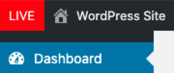
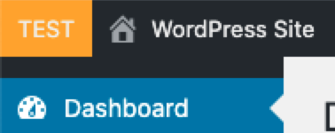
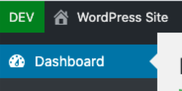
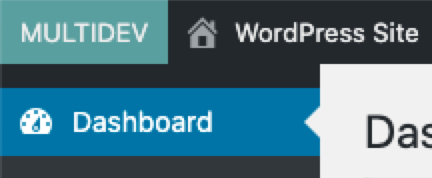
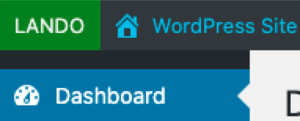

# Pantheon Environment Admin Bar
### WordPress Plugin

*Color specific admin bar visual representation of the current Pantheon Environment*

Specifically for Pantheon hosting environment (requires Pantheon to work).

Sometimes when you have 50 different browser windows open, you may lose track of which environment the open page is
from.

While yes, you can just look at the URL bar, this plugin adds a very basic visual representation in the admin bar, of
which Pantheon environment you're currently on.

Value is based on `$_ENV['PANTHEON_ENVIRONMENT']`

### Screenshots

### Changelog

= 1.0 = February 2, 2021
* Initial Release
